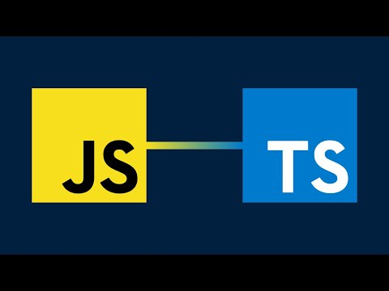
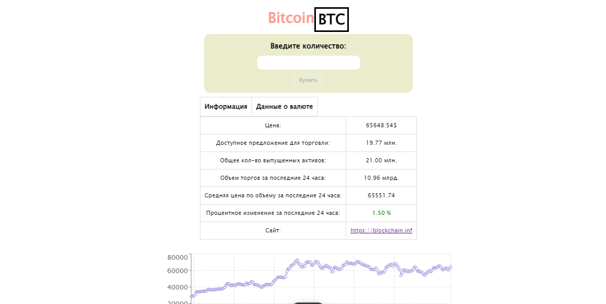

<!-- PROJECT LOGO -->
<br />
<div align="center">
  <a href="https://react.dev/">
    
  </a>

  <h3 align="center">CoinCap</h3>
 <p align="center"> 
    <a href="https://github.com/pablitodon/coincap"><strong>Изучить документацию »</strong></a> 
    <br /> 
    <a href="https://coincap-alpha.vercel.app/">Посмотреть демонстрацию</a> 
    · 
    <a href="https://github.com/pablitodon/coincap/issues/new">Сообщить об ошибке</a> 
  </p> 
</div>

<!-- ABOUT THE PROJECT -->

# О Проекте

[](https://github.com/pablitodon/coincap)

## Описание приложения

Это приложение для отслеживания и управления вашим криптовалютным портфелем. Оно предоставляет пользователям удобный интерфейс для просмотра цен на различные криптовалюты, добавления их в свой портфель и анализа их исторической статистики через графики.

### Главная страница

На главной странице отображается **таблица криптовалют**, содержащая основную информацию о каждой валюте, а также кнопку для добавления в портфель (например, "+"). Реализована функция **пагинации**, что позволяет удобно просматривать длинные списки валют.

При нажатии на элемент таблицы открывается **страница с подробной информацией** о выбранной валюте. Здесь вы сможете просмотреть:

- Контрол для добавления валюты в портфель.
- График истории цен, с использованием библиотек для визуализации данных.

При нажатии на кнопку "+", открывается **модальное окно**, где можно ввести количество (в том числе дробное) криптовалюты. После нажатия на **submit**, валюта добавляется в портфель.

### Роутинг

Приложение поддерживает **роутинг**, и кнопка "Вернуться" браузера работает корректно, что позволяет пользователям легко перемещаться по страницам.

### Header

В **шапке** приложения отображаются:

- Стоимость трёх популярных криптовалют.
- Общая стоимость портфеля пользователя с указанием разницы с начальной стоимостью портфеля (в процентах). Например: `134,32 USD +2,38 (1,80 %)`.

При обновлении портфеля, приложение хранит информацию о стоимости добавленных валют на момент обновления. При следующем запуске (reload) мы получаем текущие цены и можем обновить информацию о разнице.

При нажатии на информацию о портфеле открывается **модальное окно** со списком валют в портфеле и возможностью удалить каждую из них.

### Хранение данных

Портфель является **устойчивым к перезагрузке** страницы благодаря использованию **localStorage**.

### Дизайн

Дизайн приложения стремится быть простым, понятным и функциональным, чтобы обеспечить пользователям комфортный опыт. Поддерживается отображение на мобильных устройствах и планшетах.

---

Для дальнейших вопросов и предложений, пожалуйста, обращайтесь к разработчикам! 🚀

## Начиная

Чтобы запустить локальную копию, следуйте этим простым примерам шагов.
### Установка

# Установка проекта с использованием CoinCap API

Для получения доступа к функционалу приложения с помощью CoinCap API выполните следующие шаги:

## Получение API-ключа

1. Перейдите на [CoinCap API](https://coincap.io).
2. Зарегистрируйтесь или войдите в свою учетную запись.
3. Найдите раздел для получения API-ключа и получите свой уникальный ключ.


## Установка пакетов NPM
### Установите необходимые пакеты:

```sh
npm install
## Клонирование репозитория
```
**Клонируйте репозиторий с помощью следующей команды:**

```sh
git clone https://github.com/github_username/repo_name.git
```

##Настройка переменных окружения\*\*
**Создайте файл .env в корневом каталоге проекта.**

**Добавьте следующие строки в файл .env:**

```plaintext
VITE_COINCAP_API_URL=https://api.coincap.io/v2
VITE_COINCAP_API_KEY=ваш_ключ_API
```

**Замените ваш_ключ_API на ваш настоящий API ключ.**

Использование переменных окружения в коде
Вы можете получить доступ к этим переменным в вашем коде следующим образом:

```javascript
const COINCAP_API_URL = import.meta.env.VITE_COINCAP_API_URL;
const COINCAP_API_KEY = import.meta.env.VITE_COINCAP_API_KEY;
```

Теперь вы готовы использовать CoinCap API в вашем проекте! 🚀💰

<!-- CONTACT -->

## Контакты

Мой телеграм: - [Telegram](https://t.me/donpabloooo)

Ссылка на проект: [GitHub](https://github.com/pablitodon/coincap)

### Построено с

- [![React][React.js]][React-url] - Библиотека для создания пользовательских интерфейсов
- [![HTML][HTML]][HTML-url] - Структура веб-страниц
- [![CSS][CSS]][CSS-url] - Стилизация интерфейса
- [![JavaScript][JavaScript]][JavaScript-url] - Основной язык программирования приложения
- [![TypeScript][TypeScript]][TypeScript-url] - Надстройка над JavaScript для типов
- [![Chart.js][Chart.js]][Chart-url] - Библиотека для визуализации данных и графиков

  [React.js]: https://img.shields.io/badge/React-61DAFB?style=flat-square&logo=react&logoColor=black
  [HTML]: https://img.shields.io/badge/HTML-E34F26?style=flat-square&logo=html5&logoColor=white
  [CSS]: https://img.shields.io/badge/CSS-1572B6?style=flat-square&logo=css3&logoColor=white
  [JavaScript]: https://img.shields.io/badge/JavaScript-F7DF1E?style=flat-square&logo=javascript&logoColor=black
  [TypeScript]: https://img.shields.io/badge/TypeScript-007ACC?style=flat-square&logo=typescript&logoColor=white
  [Chart.js]: https://img.shields.io/badge/Chart.js-F38D37?style=flat-square&logo=chart-dot-js&logoColor=white
  [React-url]: https://reactjs.org/
  [HTML-url]: https://developer.mozilla.org/en-US/docs/Web/HTML
  [CSS-url]: https://developer.mozilla.org/en-US/docs/Web/CSS
  [JavaScript-url]: https://developer.mozilla.org/en-US/docs/Web/JavaScript
  [TypeScript-url]: https://www.typescriptlang.org/
  [Chart-url]: https://www.chartjs.org/
